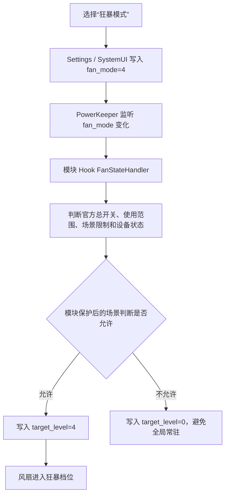
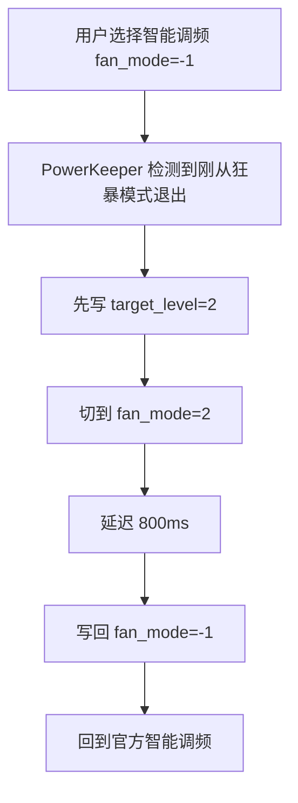

<div align="center">

# Xiaomi_FanUltra

**为 HyperOS 散热风扇新增「狂暴模式」与息屏保持开关的轻量级 LSPosed 模块**

[](#)
[](https://github.com/Yunnijian/Xiaomi_FanUltra/releases/tag/v1.1.0)
[](https://github.com/LSPosed/LSPosed)
[](LICENSE)
[](#)

<p>
  <a href="https://github.com/Yunnijian/Xiaomi_FanUltra/releases/tag/v1.1.0"><strong>下载 Release</strong></a>
  ·
  <a href="https://www.coolapk.com/u/1404550"><strong>酷安主页</strong></a>
  ·
  <a href="LICENSE"><strong>开源协议</strong></a>
</p>

</div>

---

## 📌 项目简介

`Xiaomi_FanUltra` 是一个面向 **HyperOS** 设备的轻量级 LSPosed 风扇增强模块。

模块会在系统原有散热风扇功能中新增 **「狂暴模式」**，并提供可选的 **「息屏时保持风扇开启」** 开关。模块通过 Hook `Settings`、`SystemUI` 与 `PowerKeeper`，将新增模式和息屏保持逻辑接入官方风扇控制链路。

> 本项目主要用于学习、研究和个人设备调试。不同设备、系统版本和 ROM 环境可能存在兼容性差异。

---

## ⚡ 快速下载

| 项目 | 地址 |
|---|---|
| GitHub Release | [Xiaomi FanUltra v1.1.0](https://github.com/Yunnijian/Xiaomi_FanUltra/releases/tag/v1.1.0) |
| APK 文件 | [Xiaomi_FanUltra-v1.1.0-release.apk](https://github.com/Yunnijian/Xiaomi_FanUltra/releases/download/v1.1.0/Xiaomi_FanUltra-v1.1.0-release.apk) |

> ⚠️ `v1.1.0` 因构建环境迁移重新生成了 release 签名。Android 无法将它作为旧签名版本的覆盖升级包安装；如已安装旧版本，请先卸载旧版，再安装 `v1.1.0`。

---

## ✨ 特色亮点

| 亮点 | 说明 |
|---|---|
| 🚀 新增狂暴模式 | 在官方“智能调频 / 静谧模式 / 高速强冷”之外新增更高档位 |
| 🧩 遵循官方链路 | 接入 Settings / SystemUI / PowerKeeper 官方调用流程 |
| 🛡️ 遵循官方策略 | 参考官方总开关、使用范围、场景限制和设备状态 |
| 🪶 体积小、占用低 | 轻量级 LSPosed Hook 模块，不常驻复杂服务 |
| 🔁 稳定退出 | 通过 PowerKeeper 侧中转桥接，解决偶发的切回智能调频后仍长时间维持最高转速的问题 |
| 🌙 息屏保持 | 新增可选开关，允许官方档位与狂暴模式在息屏/锁屏后继续运行 |

---

## 📖 目录

- [项目信息](#-项目信息)
- [相关依赖](#-相关依赖)
- [核心功能](#-核心功能)
- [官方风扇控制](#-官方风扇控制)
- [模块工作流程](#-模块工作流程)
- [逆向过程](#-逆向过程)
- [Hook 点说明](#-hook-点说明)
- [使用方法](#-使用方法)
- [构建](#-构建)
- [当前稳定版不包含的内容](#-当前稳定版不包含的内容)
- [开源与引用说明](#-开源与引用说明)
- [免责声明](#-免责声明)

---

## 🧾 项目信息

| 项目 | 内容 |
|---|---|
| 模块名称 | Xiaomi_FanUltra |
| 模块包名 | `com.mifan.kt` |
| 当前版本 | `1.1.0` |
| versionCode | `4` |
| 系统平台 | HyperOS |
| LSPosed API | `102` |
| 入口类 | `com.mifan.kt.HookEntry` |
| 开源协议 | [MIT License](LICENSE) |

---

## 🧱 相关依赖

| 依赖 / 环境 | 版本 / 说明 |
|---|---|
| Android Gradle Plugin | `8.13.2` |
| Kotlin Android Plugin | `2.4.0` |
| compileSdk / targetSdk | `34` |
| minSdk | `29` |
| Java / JVM Target | `17` |
| LSPosed / libxposed API | `io.github.libxposed:api:102.0.0`，`compileOnly` |
| 系统平台 | HyperOS |
| 作用域 | `com.android.settings` / `com.miui.powerkeeper` / `com.android.systemui` |

---

## 🎯 核心功能

Xiaomi_FanUltra 会在官方散热风扇功能中新增一个额外模式：

```txt
狂暴模式
```

该模式会显示在以下官方入口中：

| 入口 | 说明 |
|---|---|
| 系统设置散热风扇页面 | 在官方风扇模式列表中显示“狂暴模式” |
| 控制中心散热风扇磁贴二级页 | 在控制中心二级页中显示“狂暴模式” |

用户选择“狂暴模式”后，Settings 或 SystemUI 会沿用官方逻辑写入：

```txt
Settings.System["fan_mode"] = 4
```

随后由 PowerKeeper 侧接管策略判断，并在允许风扇运行时下发：

```txt
target_level = 4
```

最终实现比官方“高速强冷”更高的散热档位。

### 息屏时保持风扇开启

`v1.0.2` 新增同款 Settings 开关：

```txt
息屏时保持风扇开启
```

开启后，模块会在 PowerKeeper 官方策略准备因息屏/锁屏写入 `target_level=0` 时，保留最近一次由官方策略输出过的正档位，例如游戏场景中的 `target_level=3`。该逻辑作用于官方档位和狂暴模式，并继续保留官方散热风扇总开关、录音智能停转、听筒通话等高优先级停转场景。

快充高热属于独立散热保护场景：即使未开启普通“息屏时保持风扇开启”，熄屏高速充电时仍可能保持风扇档位以辅助散热。

> 该开关默认关闭。开启后可能增加耗电、噪音和风扇机械磨损，请避免在口袋、包内或密闭环境中长时间使用。

---

## 🔄 官方风扇控制

官方风扇控制链路可以概括为：

```txt
用户在系统设置或控制中心选择风扇模式
        ↓
Settings / SystemUI 写入 fan_mode
        ↓
PowerKeeper 监听设置变化
        ↓
FanStateHandler 读取总开关、使用范围、场景限制和设备状态
        ↓
FanStateHandler.J 写入 target_level
        ↓
/sys/devices/platform/soc/soc:xiaomi_fan/target_level 改变
        ↓
风扇转速变化
```

当前已确认的模式语义：

| fan_mode | 含义 | 来源 |
|---:|---|---|
| `-1` | 智能调频 | 官方 |
| `1` | 静谧模式 | 官方 |
| `2` | 高速强冷 | 官方 |
| `4` | 狂暴模式 | 本模块新增 |

> `fan_mode=-1` 是智能调频。智能调频下 `target_level` 由系统动态调控，可能是 `0/1/2`，不应固定理解为 `0`。

---

## 🧭 模块工作流程

### 选择狂暴模式



狂暴模式不会把 `fan_mode=4` 伪装成官方 `fan_mode=2`。该兼容实验在真机上会导致 PowerKeeper 持续写入 `target_level=0`，已废弃。当前稳定策略是：在官方总开关、使用范围、场景开关、锁屏、通话等保护条件成立后，由模块写入 `target_level=4`；离开有效场景时写回 `target_level=0`。

导航场景额外对齐官方行为：仅打开导航 App 不会持续启动风扇，必须同时满足 PowerKeeper 的导航场景标记和前台导航包。真实导航中导航 App 可能短暂触发录音状态，该状态不会反向停止已确认的导航场景。

### 从狂暴模式切回智能调频



该中转桥接用于解决少数情况下从狂暴模式切回智能调频后，风扇依旧长时间维持最高转速的问题。Settings 侧旧的 `fan_mode=4 -> fan_mode=2 -> fan_mode=-1` 桥接方案已验证无效，当前只保留 PowerKeeper 侧桥接。

---

## 🔍 逆向过程

### Settings 侧

通过分析系统设置 APK，确认散热风扇页面和控制器：

```txt
res/xml/cooling_fan_settings.xml
com.android.settings.coolingfan.MiuiCoolingFanSettings
com.android.settings.coolingfan.FanModeController
```

`FanModeController` 负责风扇模式 Preference 的显示、状态更新和用户选择后写入 `Settings.System["fan_mode"]`。

### PowerKeeper 侧

通过分析 PowerKeeper，确认实际风扇策略核心类：

```txt
com.miui.powerkeeper.unionpower.corehandler.FanStateHandler
```

关键私有方法：

```txt
J(String path, String value)
```

该方法最终通过小米电源 / 充电接口下发路径和值，典型目标为：

```txt
target_level
```

对应底层节点：

```txt
/sys/devices/platform/soc/soc:xiaomi_fan/target_level
```

### SystemUI 侧

通过分析 SystemUI，确认控制中心散热风扇磁贴相关类：

```txt
com.android.systemui.controlcenter.policy.CoolingFanController
com.android.systemui.qs.tiles.CoolingFanTile
com.android.systemui.qs.tiles.CoolingFanTile$CoolingFanDetailAdapter
```

控制中心二级页使用 `_secondaryItems` 作为模式列表，点击条目后会把 `SelectableItem.identity` 写入 `Settings.System["fan_mode"]`。

### 底层节点探索

当前设备已确认风扇节点位于：

```txt
/sys/devices/platform/soc/soc:xiaomi_fan
/sys/devices/virtual/xm_power/hw_monitor/pwm_fan
```

常见运行节点：

```txt
fan_support
target_level
pwm_duty
real_speed
```

设备树目录：

```txt
/sys/firmware/devicetree/base/soc/xiaomi_fan
```

设备树中可见 `compatible=xm,xm-pwm-fan`、`duty_speed_map`、`speed_adjust_cfg` 等配置，说明驱动支持 PWM 风扇；当前稳定版本只使用官方 `target_level` 链路。

---

## 🪝 Hook 点说明

### Settings Hook

| 项目 | 内容 |
|---|---|
| 目标包 | `com.android.settings` |
| 目标类 | `com.android.settings.coolingfan.FanModeController` |
| Hook 方法 | `displayPreference(...)` / `updateState(...)` / `onPreferenceChange(...)` |

作用：

- 在风扇模式下拉列表中追加“狂暴模式”；
- 追加 entryValue：`4`；
- 追加 summary：`疾速冷却，最大幅度提升散热能力`；
- 选择 `4` 时让 Settings 原生逻辑写入 `fan_mode=4`。

Settings 侧不负责实际写 `target_level`，也不负责狂暴退出桥接。

### PowerKeeper Hook

| 项目 | 内容 |
|---|---|
| 目标包 | `com.miui.powerkeeper` |
| 目标类 | `com.miui.powerkeeper.unionpower.corehandler.FanStateHandler` |
| Hook 方法 | `J(String,String)` / `W(FanStateHandler$g)` / `handleMessage(Message)` / `o()` |

作用：

- 在 `fan_mode=4` 且模块保护后的场景判断允许时，将 `target_level` 写为 `4`；
- 在 `fan_mode=4` 但当前不满足使用范围/场景/设备状态时，下发 `target_level=0`，避免全局常驻；
- 导航场景要求 PowerKeeper 导航标记与前台导航包同时成立，避免仅打开导航 App 就启动风扇；
- 在“狂暴模式 -> 智能调频”时执行 PowerKeeper 侧桥接，解决偶发的切回智能调频后风扇依旧长时间维持最高转速的问题；
- 开启“息屏时保持风扇开启”后，屏蔽官方息屏停转分支，并在部分场景使用/游戏息屏时保留最近一次官方正档位；快充高热场景可独立保持风扇散热。

关键保留逻辑：

```txt
bridgeExtremeToSmartInPowerKeeper(...)
extremeToSmartBridgeInProgress
EXTREME_TO_SMART_PK_DELAY_MS = 800L
```

### SystemUI Hook

| 项目 | 内容 |
|---|---|
| 目标包 | `com.android.systemui` |
| 目标类 | `com.android.systemui.controlcenter.policy.CoolingFanController` / `CoolingFanTile$CoolingFanDetailAdapter` |

作用：

- 向控制中心散热风扇二级页模式列表追加 `identity=4` 的条目；
- 使用合法 fallback 资源，避免 `Resources$NotFoundException`；
- 最终将该条目显示为“狂暴模式”；
- 用户点击后由 SystemUI 原生逻辑写入 `fan_mode=4`。

SystemUI 侧只新增 `identity=4`，不改写官方原生 identity，避免官方档位错乱。

---

## 📲 使用方法

### 安装模块

从 [Release 页面](https://github.com/Yunnijian/Xiaomi_FanUltra/releases/tag/v1.1.0) 下载并安装：

```txt
Xiaomi_FanUltra-v1.1.0-release.apk
```

当前包名：

```txt
com.mifan.kt
```

### LSPosed 启用作用域

在 LSPosed 中启用模块，并勾选：

```txt
com.android.settings
com.miui.powerkeeper
com.android.systemui
```

| 作用域 | 作用 |
|---|---|
| `com.android.settings` | 系统设置中显示“狂暴模式”和“息屏时保持风扇开启”开关 |
| `com.miui.powerkeeper` | 实际下发狂暴档位、处理退出逻辑和息屏保持策略 |
| `com.android.systemui` | 控制中心磁贴中显示“狂暴模式” |

### 重启相关进程

启用模块后建议重启手机，或至少重启相关进程：

```sh
su -c 'pkill -f com.android.settings'
su -c 'pkill -f com.miui.powerkeeper'
su -c 'pkill -f com.android.systemui'
```

### 验证

选择狂暴模式后验证：

```sh
settings get system fan_mode
cat /sys/devices/platform/soc/soc:xiaomi_fan/target_level
cat /sys/devices/platform/soc/soc:xiaomi_fan/real_speed
logcat -d -v time | grep -iE 'FanModeHook|FanStateHandler|target_level|fan_mode|CoolingFan'
```

预期：

```txt
fan_mode=4
有效场景中 target_level=4；离开有效场景后 target_level=0
```

从狂暴模式切回智能调频后：

```txt
fan_mode=-1
避免风扇长时间维持最高转速
```

---

## 🛠️ 构建

Debug 构建：

```sh
cd xposed-fan-mode-hook
bash scripts/build-debug.sh
```

本工作区使用项目根目录 `.toolchains/` 下的 JDK 17、Android SDK 和 Gradle 缓存。`scripts/build-debug.sh` 会自动设置 `JAVA_HOME`、`ANDROID_HOME`、`ANDROID_SDK_ROOT` 与 `GRADLE_USER_HOME`，并优先使用仓库内 `gradlew` 固定 Gradle 版本。

首次使用前需先完成本地工具链初始化，并确认：

```txt
../.toolchains/jdk-17/Contents/Home
../.toolchains/android-sdk/platforms/android-34
../.toolchains/android-sdk/build-tools/35.0.0
```

如果不使用本工作区脚本，可复制 `local.properties.example` 为 `local.properties`，并把 `sdk.dir` 改为本机 Android SDK 路径。`local.properties` 为本机配置文件，不应提交。

Release 构建需要本地提供 release key 与密码环境变量 / Gradle 属性：

```sh
cd xposed-fan-mode-hook
RELEASE_STORE_PASSWORD=... RELEASE_KEY_PASSWORD=... RELEASE_KEY_ALIAS=mifan_release \
  bash scripts/gradle.sh assembleRelease -x :app:checkReleaseAarMetadata --rerun-tasks --stacktrace
mkdir -p dist
cp -f app/build/outputs/apk/release/app-release.apk dist/Xiaomi_FanUltra-v1.1.0-release.apk
```

当前 release 版本：

```txt
versionName = 1.1.0
versionCode = 4
```

> `v1.1.0` 使用新的 release 签名密钥。该密钥仅保存在本地构建环境中，不提交到仓库。旧版本用户需要卸载后重新安装。

---

## 🚧 当前稳定版不包含的内容

当前稳定版本不包含自定义 `pwm_duty` 滑块。此前曾探索 `fan_mode=5`、`fan_custom_pwm_duty`、SeekBarPreference、IMiCharge、direct sysfs、root `su` fallback 等方案，但真机验证结果为：

```txt
fan_mode=5 和 fan_custom_pwm_duty 可以保存
pwm_duty 实际仍不可靠
PowerKeeper/IMiCharge 对 pwm_duty 写入通路不可用或受限
PowerKeeper 进程执行 su 也存在权限限制
```

因此当前稳定主线只保留官方 `fan_mode -> PowerKeeper -> target_level` 链路。

---

## 📐 维护原则

1. Settings 侧只负责 UI 和 `fan_mode=4` 写入，不恢复 Settings 侧退出桥接。
2. PowerKeeper 侧负责 `target_level=4` 下发、官方策略限制判断和狂暴退出桥接。
3. SystemUI 侧只新增 `identity=4`，不改写官方原生档位。
4. 不要把 `fan_mode=0` 当作智能调频；智能调频是 `fan_mode=-1`。
5. 不要写 `target_level=-1`。
6. 不要恢复“只要 fan_mode=4 就无条件写 4”的逻辑，否则会破坏官方总开关和使用范围。

---

## 🤝 开源与引用说明

- 作者酷安主页：[https://www.coolapk.com/u/1404550](https://www.coolapk.com/u/1404550)
- 本项目基于 [MIT License](LICENSE) 开源免费，欢迎学习、交流、适配与改进。
- 欢迎其他 Xposed / LSPosed 模块作者在遵守开源精神的前提下，将本项目相关实现合入个人项目。
- 欢迎官改 ROM 作者将本功能内置到系统中，为更多设备提供更完整的散热风扇体验。
- 如基于本项目进行二次开发、功能合并、ROM 内置或公开发布，请在项目说明、发布页或相关位置注明原作者与项目出处。

如果本项目对你有所帮助，欢迎点一个小小的 **Star**，这将是对项目继续维护和优化的支持。

---

## 📄 开源协议

本项目基于 [MIT License](LICENSE) 开源。

---

## ⚠️ 免责声明

本项目仅用于学习、研究和个人设备调试。Hook 系统组件存在兼容性风险，使用前请确认理解相关风险。因系统版本差异、设备差异或使用不当导致的问题需自行承担。
